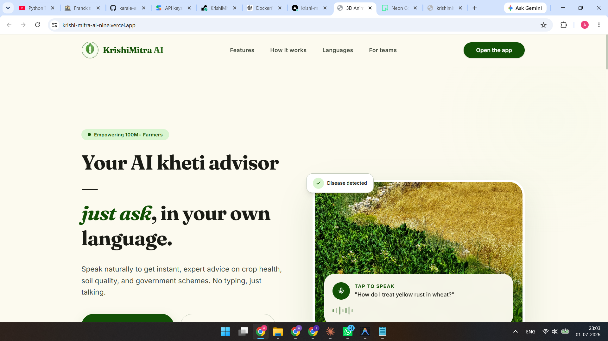

<div align="center">

# 🌾 KrishiMitra AI

### Your AI Kheti Advisor — Just Ask, In Your Own Language

[](https://spring.io/projects/spring-boot)
[](https://react.dev/)
[](https://python.org)
[](https://www.postgresql.org/)
[](https://ai.google.dev/)
[](LICENSE)

*Empowering 100M+ Indian Farmers with Voice-First AI Agriculture Advisory*

<br/>



</div>

---

## 🚀 What is KrishiMitra AI?

**KrishiMitra AI** is a voice-first, multilingual agriculture advisory platform built for Indian farmers. Speak naturally to get instant, expert advice on crop health, soil quality, weather, government schemes, and more — **no typing, just talking.**

> 🎙️ *"How do I treat yellow rust in wheat?"* — Ask in Hindi, Marathi, Telugu, Kannada, or English.

---

## ✨ Key Features

| Feature | Description |
|---------|-------------|
| 🎤 **Voice Assistant** | Speak in your language — Whisper STT + Indic-TTS for natural conversations |
| 🌿 **Disease Detection** | Upload a photo of your crop — ONNX ML model identifies diseases instantly |
| 🌾 **Crop Recommendation** | Get AI-powered crop suggestions based on soil, climate, and location |
| ☀️ **Weather & Climate Risk** | Real-time weather data + climate risk analysis for your farm |
| 📋 **Scheme Recommendation** | Discover relevant government schemes with Gemini AI |
| 🌐 **Multilingual** | Full support for Hindi, Marathi, Telugu, Kannada, and English |
| 📊 **Farm Analytics** | Track and analyze your farm's performance over time |
| 🔐 **Secure Auth** | JWT-based authentication with Spring Security |

---

## 🏗️ Architecture

```
┌─────────────────────────────────────────────────────┐
│                  KrishiMitra AI                      │
├──────────────┬──────────────────┬────────────────────┤
│   Frontend   │     Backend      │    AI Sidecar      │
│  React + TS  │  Spring Boot 3.5 │  FastAPI (Python)  │
│  Vite + MUI  │  Java 17         │  Whisper STT       │
│  TailwindCSS │  PostgreSQL 16   │  IndicTrans2       │
│  Recharts    │  Flyway           │  Indic-TTS         │
│              │  Spring Security │  ONNX Runtime      │
│              │  Gemini 2.5 Flash│                    │
└──────────────┴──────────────────┴────────────────────┘
```

### System Components

| Component | Tech Stack | Purpose |
|-----------|-----------|---------|
| **Frontend** | React 18, TypeScript, Vite, MUI, TailwindCSS 4 | Responsive UI with voice interaction |
| **Backend** | Spring Boot 3.5, Java 17, PostgreSQL, Flyway | REST APIs, auth, business logic, on-device ML |
| **AI Sidecar** | FastAPI, Whisper, IndicTrans2, Indic-TTS | Heavy ML model inference (STT, Translation, TTS) |
| **Database** | PostgreSQL 16 (Neon / Docker) | Persistent storage with JPA + Flyway migrations |
| **AI/LLM** | Google Gemini 2.5 Flash | Scheme recommendations, conversational AI |

---

## 📁 Project Structure

```
KrishiMitra/
├── krishimitra-frontend/        # React + Vite frontend
│   ├── src/
│   │   ├── components/          # Reusable UI components
│   │   ├── pages/               # Page-level components
│   │   └── ...
│   └── package.json
│
├── krishimitra-backend/         # Spring Boot backend
│   ├── src/main/java/com/krishimitra/
│   │   ├── analytics/           # Farm analytics module
│   │   ├── auth/                # JWT authentication & security
│   │   ├── croprecommendation/  # ML-based crop suggestions
│   │   ├── diseasedetection/    # Plant disease detection (ONNX)
│   │   ├── farm/                # Farm management
│   │   ├── farmer/              # Farmer profiles
│   │   ├── health/              # Health check & keep-alive
│   │   ├── schemerecommendation/# Govt scheme finder (Gemini)
│   │   ├── translation/         # Language translation
│   │   ├── voiceassistant/      # Voice interaction controller
│   │   ├── weather/             # Weather & climate risk
│   │   └── shared/              # Common DTOs, exceptions, utils
│   ├── ai-sidecar/              # Python ML microservice
│   │   ├── main.py              # FastAPI application
│   │   ├── services/            # STT, TTS, Translation services
│   │   └── Dockerfile
│   └── pom.xml
│
├── docker-compose.yml           # PostgreSQL dev setup
└── README.md
```

---

## ⚡ Quick Start

### Prerequisites

- **Java 17+**
- **Node.js 18+** & **npm / pnpm**
- **Python 3.11+** (for AI Sidecar)
- **Docker** (for PostgreSQL)
- **Gemini API Key** ([Get one here](https://ai.google.dev/))

### 1. Clone the Repository

```bash
git clone https://github.com/karale-aryan/KrishiMitra-Ai.git
cd KrishiMitra-Ai
```

### 2. Start PostgreSQL

```bash
docker-compose up -d
```

### 3. Start the Backend

```bash
cd krishimitra-backend

# Create .env from example
cp .env.example .env
# Edit .env with your API keys

# Run with Maven
./mvnw spring-boot:run
```

The backend starts at **http://localhost:8080**

### 4. Start the AI Sidecar (Optional)

```bash
cd krishimitra-backend/ai-sidecar
pip install -r requirements.txt
python main.py
```

The AI sidecar starts at **http://localhost:8000**

### 5. Start the Frontend

```bash
cd krishimitra-frontend
npm install
npm run dev
```

The frontend starts at **http://localhost:5173**

---

## 🔧 Environment Variables

### Backend (`krishimitra-backend/.env`)

| Variable | Description | Default |
|----------|-------------|---------|
| `KRISHIMITRA_DB_HOST` | PostgreSQL host | `localhost` |
| `KRISHIMITRA_DB_PORT` | PostgreSQL port | `5432` |
| `KRISHIMITRA_DB_NAME` | Database name | `krishimitra` |
| `KRISHIMITRA_DB_USERNAME` | DB username | `krishimitra` |
| `KRISHIMITRA_DB_PASSWORD` | DB password | `krishimitra_secret` |
| `KRISHIMITRA_JWT_SECRET` | JWT signing secret | Auto-generated |
| `GEMINI_API_KEY` | Google Gemini API key | — |
| `AI_SIDECAR_URL` | AI Sidecar base URL | `http://localhost:8000` |
| `CORS_ORIGINS` | Allowed CORS origins | `http://localhost:3000,http://localhost:5173` |
| `RENDER_EXTERNAL_URL` | Render deployment URL (keep-alive) | — |

---

## 🌐 API Endpoints

### Public Endpoints (No Auth Required)

| Method | Endpoint | Description |
|--------|----------|-------------|
| `GET` | `/api/health` | Health check (Render keep-alive) |
| `POST` | `/api/v1/auth/register` | Register new farmer |
| `POST` | `/api/v1/auth/login` | Login |
| `GET` | `/api/v1/weather/current` | Current weather |
| `GET` | `/api/v1/weather/forecast` | Weather forecast |

### Protected Endpoints (JWT Required)

| Method | Endpoint | Description |
|--------|----------|-------------|
| `POST` | `/api/v1/voice/**` | Voice assistant interaction |
| `POST` | `/api/v1/crops/recommend` | Crop recommendation |
| `POST` | `/api/v1/disease/detect` | Disease detection (image upload) |
| `GET` | `/api/v1/schemes/recommend` | Government scheme recommendations |
| `GET` | `/api/v1/weather/risk/{farmId}` | Climate risk analysis |
| `GET` | `/api/v1/analytics/**` | Farm analytics |

---

## 🚢 Deployment

### Render (Production)

The application is deployed on **Render** with a self-pinging health check that keeps the backend alive every 5 minutes.

1. Set the `RENDER_EXTERNAL_URL` environment variable to your Render service URL
2. The `SelfPingScheduler` automatically pings `/api/health` every 5 minutes
3. Frontend is deployed on **Vercel**

### Docker

```bash
# Backend
cd krishimitra-backend
docker build -t krishimitra-backend .

# AI Sidecar
cd krishimitra-backend/ai-sidecar
docker build -t krishimitra-sidecar .
```

---

## 🗣️ Supported Languages

| Language | Code | STT | TTS | Translation |
|----------|------|-----|-----|-------------|
| English | `en` | ✅ | ✅ | ✅ |
| Hindi | `hi` | ✅ | ✅ | ✅ |
| Marathi | `mr` | ✅ | ✅ | ✅ |
| Telugu | `te` | ✅ | ✅ | ✅ |
| Kannada | `kn` | ✅ | ✅ | ✅ |

---

## 🧠 ML Models

| Model | Purpose | Runtime |
|-------|---------|---------|
| **Crop Recommendation** | Suggests optimal crops based on soil/climate data | ONNX (Java) |
| **Plant Disease Detection** | Identifies crop diseases from leaf images | ONNX (Java) |
| **OpenAI Whisper** | Speech-to-Text for voice input | Python (Sidecar) |
| **IndicTrans2** | Multilingual translation (AI4Bharat) | Python (Sidecar) |
| **Indic-TTS** | Text-to-Speech for audio responses | Python (Sidecar) |

---

## 🤝 Contributing

Contributions are welcome! Please feel free to submit a Pull Request.

1. Fork the repository
2. Create your feature branch (`git checkout -b feature/amazing-feature`)
3. Commit your changes (`git commit -m 'feat: add amazing feature'`)
4. Push to the branch (`git push origin feature/amazing-feature`)
5. Open a Pull Request

---

## 📄 License

This project is licensed under the MIT License — see the [LICENSE](LICENSE) file for details.

---

<div align="center">

**Built with ❤️ for Indian Farmers**

🌾 *KrishiMitra AI — Empowering Agriculture with Technology* 🌾

</div>
